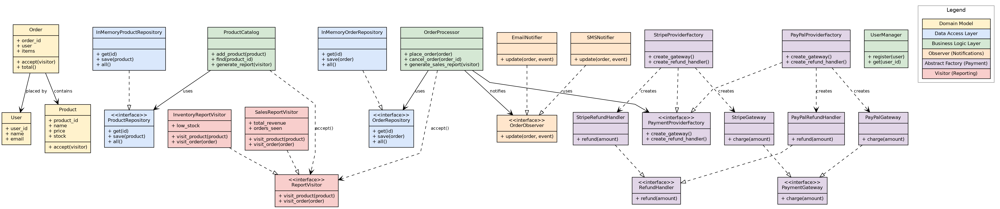

# Unit 9: Software Architecture
### ShopEase: Layered E-Commerce Architecture

## Task

Design an object-oriented software architecture for an online shopping
system (ShopEase), addressing scalability, modularity, security, and
extensibility, using a layered architecture (Presentation, Business Logic,
Data Access).

This unit had no formal submission portal or discussion forum. The work
below was produced as a design exercise, its patterns were deliberately
chosen to also serve as EMA artefacts for Abstract Factory and Visitor,
since no other unit's work provides those.

## Architecture Diagram

Color key: yellow (domain models), blue (data access layer), green
(business logic layer), orange (observer/notifications), purple (abstract
factory/payment), pink (visitor/reporting).

## How Each Requirement Shaped the Design

**Scalability.** A growing number of users and products will eventually hit
a capacity or performance ceiling on whatever storage is used. Business
logic classes (ProductCatalog, OrderProcessor) never talk to a specific
storage technology directly; they depend only on an interface (get, save,
all), with the concrete implementation handed in from outside at
construction time. This is the Repository pattern: ProductRepository and
OrderRepository as interfaces, with InMemoryProductRepository and
InMemoryOrderRepository as swappable implementations.

**Modularity.** Independent modules means UserManager, ProductCatalog, and
OrderProcessor hold no direct knowledge of each other and never appear in
one another's constructors. Order is the deliberate exception, the one
place a User and a set of Products are allowed to meet. All wiring (looking
up a user, looking up products, assembling an order, handing it to
OrderProcessor) happens in a single separate place, the composition root
(main.py), the only part of the system allowed to know about everything.

**Security.** This splits into two different problems. For credentials,
User holds a hashed password (bcrypt, per the Unit 7 authentication work),
never plaintext. For payment data, ShopEase's own code never receives or
stores raw card details at all: PaymentGateway.charge(amount) and
RefundHandler.refund(amount) only ever take a monetary amount, since card
capture and validation happen entirely inside Stripe or PayPal's own
systems. This keeps ShopEase outside PCI-DSS's stricter obligations by
design.

**Extensibility.** Adding or removing a payment provider should not require
editing OrderProcessor. A payment provider is also not one capability but
two, charging and refunding, and those two must never be mismatched (a
Stripe charge paired with a PayPal refund, for example). Rather than
injecting a gateway and refund handler as two independent objects, a single
factory produces a matched pair from the same provider by construction.
This is the Abstract Factory pattern: StripeProviderFactory and
PayPalProviderFactory each produce their own gateway/refund-handler pair,
and OrderProcessor depends only on the abstract PaymentProviderFactory,
never on Stripe or PayPal by name.

**Layered architecture and notifications.** OrderProcessor should not need
to know the specific list of notification channels, or edit itself every
time that list changes. It holds a generic list of observers, each
satisfying the same OrderObserver interface, and announces events without
knowing who is listening or how many; EmailNotifier and SMSNotifier are two
current implementations. Stepping back, every mechanism above (Repository,
the composition root, Abstract Factory, Observer) is a specific application
of a single underlying principle: decoupling, keeping two classes
structurally apart so that changing one never forces a change in the other.
"Layers" is simply the name for grouping these decoupled relationships into
broad categories: Data Access, Business Logic, and the boundary with the
outside world.

## Patterns Added Beyond the Brief

Abstract Factory is also a legitimate answer to the brief's own
Extensibility requirement, so its inclusion is justified by the brief
itself. Visitor (ReportVisitor, SalesReportVisitor,
InventoryReportVisitor) is not requested anywhere in the brief; it was
added because the EMA's Task 2 requires a Visitor artefact and no other
unit provides one. The justification used is that a real store would
plausibly want sales and inventory reports without cluttering Product or
Order with reporting logic unrelated to what a product or order is, a
reasonable design choice on its own merits, but motivated here by portfolio
completeness rather than the Unit 9 brief.

## Implementation Status

The design was worked through in full before any code was written. Of the
six-file structure it produced (models.py, repositories.py,
notifications.py, payment.py, reporting.py, business_logic.py), only
models.py (Product.accept(), Order.accept(), Order.total()) is currently
implemented; the remaining files exist as interface definitions and
method stubs.

## Reflection

It was nice to get away from the code and really focus on simply designing
the architecture. In fact, this exercise reinforced for me the importance
of up-front module and interface design before getting right into the
code. Prior to that, I could only think about which file I should write
first, but I had no concept of which class went into which file.

I guess that is the thing with monolithic development: you start at the
very beginning. But with object-oriented design, it is hard to know where
to start. The UML diagram I produced as an aid really helped with that.
